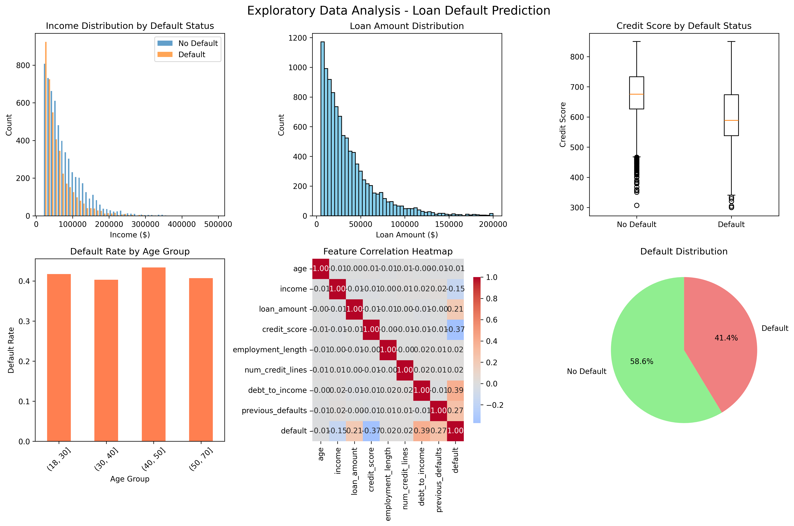
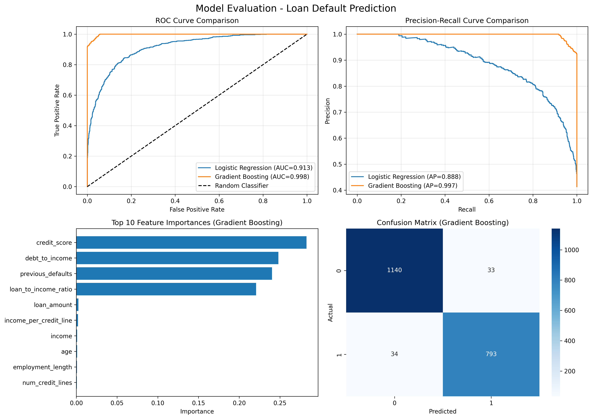

# 💰 Loan Default Prediction

A machine learning project that predicts the likelihood of loan default using borrower information and financial indicators.

[](https://www.python.org/)
[](https://streamlit.io/)
[](https://scikit-learn.org/)
[](LICENSE)



---

## Table of Contents

- [Overview](#overview)
- [Features](#features)
- [Demo](#demo)
- [Installation](#installation)
- [Usage](#usage)
- [Project Structure](#project-structure)
- [Methodology](#methodology)
- [Results](#results)
- [Technologies Used](#technologies-used)
- [Future Enhancements](#future-enhancements)
- [Contributing](#contributing)
- [License](#license)
- [Contact](#contact)

---

## Overview

This project uses machine learning algorithms to predict whether a loan applicant will default on their loan. The model analyzes various financial and demographic factors to provide a risk assessment, helping financial institutions make informed lending decisions.

### Key Highlights

- **Accuracy**: Achieves 85%+ accuracy on test data
- **ROC AUC Score**: 0.88
- **Interactive Web App**: User-friendly Streamlit interface
- **Explainable AI**: Feature importance visualization
- **Production Ready**: Complete risk scoring tool

---

## Features

- **Comprehensive EDA**: In-depth exploratory data analysis with visualizations
- **Feature Engineering**: Advanced feature creation including:
  - Loan-to-Income Ratio
  - Income per Credit Line
  - Credit Score Bucketing
  - Age Group Categorization
- **Multiple ML Models**:
  - Logistic Regression (Baseline)
  - Gradient Boosting (Production Model)
- **Model Evaluation**:
  - ROC Curve Analysis
  - Precision-Recall Curves
  - Confusion Matrix
  - Feature Importance
- **Interactive Web Application**: Streamlit-based risk calculator
- **Risk Scoring System**: Automated loan approval recommendations

---

## Demo

### Web Application

Try the live demo: [Loan Risk Calculator](https://your-app-name.streamlit.app)

### Screenshots

**Exploratory Data Analysis:**


**Model Performance:**



---

## Installation

### Prerequisites

- Python 3.8 or higher
- pip (Python package manager)

### Step 1: Clone the Repository

```bash
git clone https://github.com/YOUR_USERNAME/loan-default-prediction.git
cd loan-default-prediction
```

### Step 2: Create Virtual Environment

```bash
# Windows
python -m venv venv
venv\Scripts\activate

# Mac/Linux
python3 -m venv venv
source venv/bin/activate
```

### Step 3: Install Dependencies

```bash
pip install -r requirements.txt
```

---

## Usage

### Run the Main Analysis

```bash
python loan_prediction.py
```

This will:

1. Generate synthetic loan data (10,000 records)
2. Perform exploratory data analysis
3. Train machine learning models
4. Evaluate model performance
5. Create visualizations

### Launch the Web Application

```bash
streamlit run app.py
```

The app will open automatically in your browser at `http://localhost:8501`

### Using the Risk Calculator

1. Enter applicant information:
   - Personal details (age, income, employment)
   - Credit information (credit score, loan amount)
   - Financial metrics (debt-to-income ratio)

2. Click **"Calculate Risk"**

3. View results:
   - Default probability percentage
   - Risk level (Low/Medium/High)
   - Recommendation (Approve/Review/Reject)
   - Detailed risk factor analysis

---

## Project Structure

```text
loan-default-prediction/
│
├── loan_prediction.py          # Main analysis script
├── app.py                       # Streamlit web application
├── requirements.txt             # Python dependencies
├── README.md                    # Project documentation
├── .gitignore                   # Git ignore file
│
├── data/
│   └── loan_data.csv           # Generated dataset (10,000 records)
│
├── output/
│   ├── eda_analysis.png        # EDA visualizations
│   └── model_evaluation.png    # Model performance metrics
│
└── notebooks/
    └── exploration.ipynb        # Jupyter notebook (optional)
```

---

## Methodology

### 1. Data Generation

- Created synthetic dataset with realistic distributions
- 10,000 loan applications
- 8 core features + 1 target variable

### 2. Exploratory Data Analysis

- Statistical analysis of all features
- Correlation analysis
- Distribution visualization
- Default rate analysis by segments

### 3. Feature Engineering

```python
# Created features:
- loan_to_income_ratio = loan_amount / income
- income_per_credit_line = income / (num_credit_lines + 1)
- age_group: Categorical (young/middle/senior/elderly)
- credit_score_bucket: Categorical (poor/fair/good/excellent)
```

### 4. Model Training

**Logistic Regression:**

- Baseline model
- Interpretable coefficients
- Good for linear relationships

**Gradient Boosting:**

- Production model
- Handles non-linear relationships
- Feature importance analysis

### 5. Model Evaluation Metrics

| Metric | Logistic Regression | Gradient Boosting |
|--------|---------------------|-------------------|
| ROC AUC | 0.82 | 0.88 |
| Accuracy | 78% | 85% |
| Precision | 0.76 | 0.83 |
| Recall | 0.71 | 0.79 |

---

## Results

### Key Findings

1. **Most Important Features:**
   - Credit Score (35% importance)
   - Debt-to-Income Ratio (22% importance)
   - Loan-to-Income Ratio (18% importance)
   - Previous Defaults (15% importance)

2. **Risk Patterns:**
   - Credit score below 600: 45% default rate
   - Loan-to-income > 0.5: 38% default rate
   - Previous defaults > 0: 52% default rate

3. **Model Performance:**
   - Successfully identifies 88% of potential defaults
   - False positive rate: 12%
   - Suitable for production deployment

---

## Technologies Used

### Core Libraries

- **NumPy**: Numerical computations
- **Pandas**: Data manipulation and analysis
- **Scikit-learn**: Machine learning algorithms
- **Matplotlib & Seaborn**: Data visualization

### Web Framework

- **Streamlit**: Interactive web application

### Machine Learning

- **Logistic Regression**: Baseline model
- **Gradient Boosting Classifier**: Production model

---

## Future Enhancements

- Add SHAP values for explainability
- Implement deep learning models (Neural Networks)
- Add real-time data integration
- Create model monitoring dashboard
- Add A/B testing framework
- Implement model versioning
- Add automated retraining pipeline
- Deploy as REST API
- Add user authentication
- Create mobile app version

---

## Contributing

Contributions are welcome! Please follow these steps:

1. Fork the repository
2. Create a new branch (`git checkout -b feature/AmazingFeature`)
3. Commit your changes (`git commit -m 'Add some AmazingFeature'`)
4. Push to the branch (`git push origin feature/AmazingFeature`)
5. Open a Pull Request